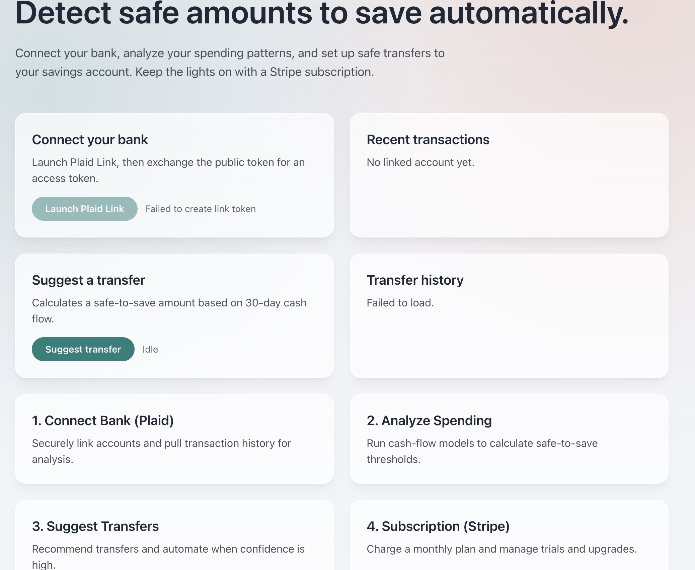

# Automated Savings Service



Prototype for an automated savings product that connects bank accounts, analyzes cash flow, and schedules safe transfers.

## Stack

- Next.js (App Router)
- Tailwind CSS
- React Query + tRPC
- PostgreSQL + Prisma
- Stripe webhooks
- Plaid Link
- Background worker script

## Requirements

- Node 20.x

## Environment variables

- `DATABASE_URL` (required): Postgres connection string
- `PLAID_CLIENT_ID` (required): Plaid client ID
- `PLAID_SECRET` (required): Plaid secret
- `PLAID_ENV` (required): `sandbox`, `development`, or `production`
- `PLAID_PRODUCTS` (optional): comma-separated product list (default `transactions`)
- `PLAID_COUNTRY_CODES` (optional): comma-separated country list (default `US`)
- `PLAID_REDIRECT_URI` (optional): redirect URI for Link OAuth flows
- `STRIPE_SECRET_KEY` (required): Stripe secret key
- `STRIPE_WEBHOOK_SECRET` (required): Stripe webhook signing secret
- `STRIPE_PRICE_ID` (required): Stripe price for subscription
- `NEXT_PUBLIC_STRIPE_PUBLISHABLE_KEY` (required): Stripe publishable key
- `NEXT_PUBLIC_APP_URL` (required): base URL for redirects
- `DEMO_USER_EMAIL` (optional): demo user email (default `demo@automatedsavings.local`)

## What this project covers

- Bank linking via Plaid Link
- Token exchange + persistence in PostgreSQL
- Transaction sync (last 30 days) and local caching
- Plaid webhook handling for transaction updates
- Safe-to-save calculation and transfer scheduling
- Transfer history and status tracking
- Stripe Checkout subscription flow
- Stripe webhook subscription sync
- Background worker to process due transfers
- tRPC API foundation for product logic

## Architecture overview

- UI (Next.js App Router) calls API routes and tRPC
- API routes call Plaid/Stripe SDKs and Prisma
- Prisma persists users, linked items, transactions, transfers, subscriptions
- Webhooks update cached data and subscription state
- Worker processes due transfers on a schedule

## Local dev setup

1. Copy env vars:

```bash
cp .env.example .env
```

2. Fill in Plaid + Stripe credentials.

3. Install deps and run dev server:

```bash
npm install
npm run dev
```

4. Push Prisma schema:

```bash
npm run db:push
```

5. Run the worker:

```bash
npm run worker
```

## Webhook setup (local)

- Stripe:
  - Use Stripe CLI: `stripe listen --forward-to localhost:3000/api/stripe/webhook`
  - Copy the signing secret into `STRIPE_WEBHOOK_SECRET`
- Plaid:
  - Use a tunnel (ngrok/cloudflared) to expose `/api/plaid/webhook`
  - Configure the webhook URL in Plaid dashboard for the app

## API endpoints

- `POST /api/plaid/link-token` → create a Plaid Link token
- `POST /api/plaid/exchange-public-token` → exchange public token and persist item
- `GET /api/plaid/transactions` → fetch and cache latest transactions
- `POST /api/plaid/webhook` → receive Plaid webhooks
- `POST /api/stripe/checkout` → create Stripe Checkout session
- `POST /api/stripe/webhook` → receive Stripe webhooks
- `POST /api/transfers/suggest` → compute safe-to-save and schedule transfer
- `GET /api/transfers` → list recent transfers
- `POST /api/trpc/*` → tRPC router endpoint

## Worker

- Script: `scripts/worker.ts`
- Runs via `npm run worker` or cron
- Processes transfers with `status="scheduled"` and `scheduledFor <= now`
- Updates status to `processing` then `completed`

## Quick start

1. Copy env vars:

```bash
cp .env.example .env
```

2. Fill in Plaid + Stripe credentials.

3. Install deps and run dev server:

```bash
npm install
npm run dev
```

4. Push Prisma schema:

```bash
npm run db:push
```

5. Run the worker:

```bash
npm run worker
```

## Cron
Run the worker every 30 minutes:

```bash
*/30 * * * * /Users/super/projects/evenstar/automated_savings_service/scripts/worker-cron.sh
```

## Roadmap

- Auth + multi-user support
- Plaid account/balance sync
- Transfer approvals + rollback handling
- Budget targets and goal-based savings
- Production worker queue (BullMQ/Redis)

## Security notes

- Access tokens are stored in Postgres; use encryption at rest in production
- Webhooks must be verified (Stripe signature already verified; Plaid should be verified before production)
- Avoid logging PII or raw webhook payloads in production

## Testing

- Lint: `npm run lint` (first run will prompt Next.js ESLint config)
- Typecheck: `npx tsc --noEmit`

## Notes

- tRPC endpoint: `src/app/api/trpc/[trpc]/route.ts`
- Plaid Link token: `src/app/api/plaid/link-token/route.ts`
- Plaid transactions: `src/app/api/plaid/transactions/route.ts`
- Plaid webhook: `src/app/api/plaid/webhook/route.ts`
- Stripe webhook: `src/app/api/stripe/webhook/route.ts`
- Stripe checkout: `src/app/api/stripe/checkout/route.ts`
- Prisma schema: `prisma/schema.prisma`
- Plaid UI component: `src/components/plaid-link-button.tsx`
- Plaid transactions component: `src/components/plaid-transactions.tsx`
- Stripe subscribe component: `src/components/stripe-subscribe-button.tsx`
- Transfer suggestion endpoint: `src/app/api/transfers/suggest/route.ts`
- Transfer suggest UI: `src/components/transfer-suggest-button.tsx`
- Transfers list endpoint: `src/app/api/transfers/route.ts`
- Transfer history UI: `src/components/transfer-history.tsx`
